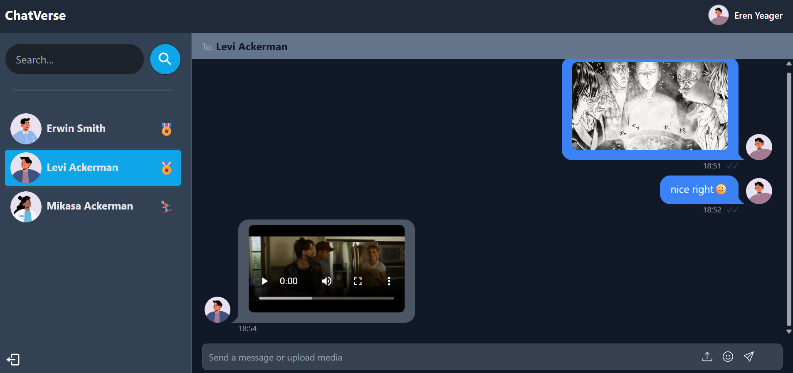

# 💬 ChatApp

A real-time private chat application built using **React**, **Node.js**, **Socket.io**, and **MongoDB**, supporting **media sharing** and **blue tick read receipts**.

---

## 🚀 Features

- 🔐 User Authentication (JWT)
- 💬 Private 1-on-1 messaging
- 📁 Media sharing (images/files)
- ✅ Blue tick when message is read
- 🕐 Timestamps for messages
- 📱 Fully responsive UI

---

## 🛠️ Tech Stack

**Frontend:**
- React.js
- Tailwind CSS
- Socket.io-client

**Backend:**
- Node.js + Express
- MongoDB + Mongoose
- Socket.io
- Multer (for media upload to local server)

### 💬 Chat Interface with Media Sharing & Blue Ticks

## 🔧 Installation & Running the App

### 1. Clone the Repository

```bash
git clone https://github.com/SakshamSharma10989/ChatApp.git
cd ChatApp

